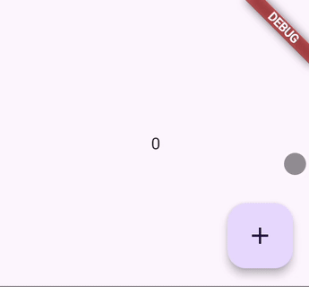

# Walk through the example apps

This page connects the visual examples to the framework concepts behind them.

## Counter example

The counter example is the smallest Scale Framework feature. It demonstrates:

- one `StateManager<int>`
- one `FeatureModule`
- one `StateBuilder<int>`
- widget-driven state updates through `context.getStateManager<T>()`

Use it when you want to understand the base pattern before adding loaders or binders.

Related doc: [Build your first feature](build-your-first-feature.md)

## Loader example

The loader example adds backend data flow on top of the same composition model. It demonstrates:

- `addLoader<T, TDto>`
- `MapperOf<TDto>`
- `LoaderModelsFactory<T, TDto>`
- `LoaderWidget<T>`
- automatic first request on app start

Use it when you want one feature to own its request lifecycle and UI states.

Related doc: [Load data with `LoaderWidget`](load-data-with-loader-widget.md)

## Deferred loader example

The deferred example shows a loader configured with `initializeOnAppStart: false`. It demonstrates:

- delaying the first request until user action or pushed notification
- keeping loader setup in the module even when request timing changes
- separating request configuration from refresh trigger

Important nuance: the feature still renders `loading()` until the first refresh or notification happens.

## How to read the examples

Each example is best understood as three layers:

| Layer | Question it answers |
| --- | --- |
| Module | What dependencies does this feature register? |
| State or loader | What data shape does this feature own? |
| Widget | How does the UI react to that state? |

If you keep those three layers separate, the framework stays easy to reason about even as the feature grows.

## Where to go next

- Need a recipe? Start in [How-to guides](../how-to/register-feature-modules-and-clusters.md).
- Need exact API details? Start in [Reference](../reference/module-setup-and-registry.md).
- Need rationale? Start in [Explanation](../explanation/how-scale-framework-is-structured.md).
