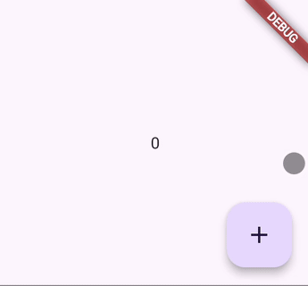

## Basic Counter App

To create the simple counter app we need 3 parts: A StateManager, a Widget, and a FeatureModule that brings them together.
 
<table>

<tr>
<td colspan="2" align="center">



</td>        
</tr>
    <tr>
        <td> State Manager </td> 
        <td> Widget </td>
    </tr>
<tr align="start">
<td>


```dart
import 'package:scale_framework/scale_framework.dart';

class CounterStateManager extends StateManager<int> {
  CounterStateManager() : super(0);

  void increment() => pushNewState((oldState) => oldState + 1);
}

```

</td>
<td>

```dart
import 'package:flutter/material.dart';
import 'package:scale_framework/scale_framework.dart';

import 'state_manager.dart';

class CountWidget extends StatelessWidget {
  const CountWidget({super.key});

  @override
  Widget build(BuildContext context) {
    return Scaffold(
      // StateBuilder reacts to any state change of int.
      body: StateBuilder<int>(
        builder: (context, count) => Center(child: Text('$count')),
      ),
      floatingActionButton: FloatingActionButton(
        onPressed: () => increment(context),
        child: const Icon(Icons.add),
      ),
    );
  }

  // Acquires the CounterStateManager
  // call increment method on that manager
  void increment(BuildContext context) =>
      context.getStateManager<CounterStateManager>().increment();
}

```

</td>
</tr>
  <tr>
        <td> Feature Module </td> 
        <td> Putting it all together </td>
    </tr>
<tr>
<td>


```dart
import 'package:scale_framework/scale_framework.dart';

import 'state_manager.dart';

class CounterFeatureModule extends FeatureModule {
  @override
  void setup(PublicRegistry registry) {
    registry.addGlobalStateManager(CounterStateManager());
  }
}
```

</td>
<td>

```dart
import 'package:flutter/material.dart';
import 'package:scale_framework/scale_framework.dart';

import 'module.dart';
import 'widget.dart';

void main() {
  runApp(const MyApp());
}

class MyApp extends StatelessWidget {
  const MyApp({super.key});

  @override
  Widget build(BuildContext context) {
    return MaterialApp(
      title: 'Flutter Demo',
      theme: ThemeData(colorScheme: .fromSeed(seedColor: Colors.deepPurple)),
      home: ModuleSetup(
        featureModules: [CounterFeatureModule()],
        child: CountWidget(),
      ),
    );
  }
}
```

</td>
</tr>
<tr>
</table>